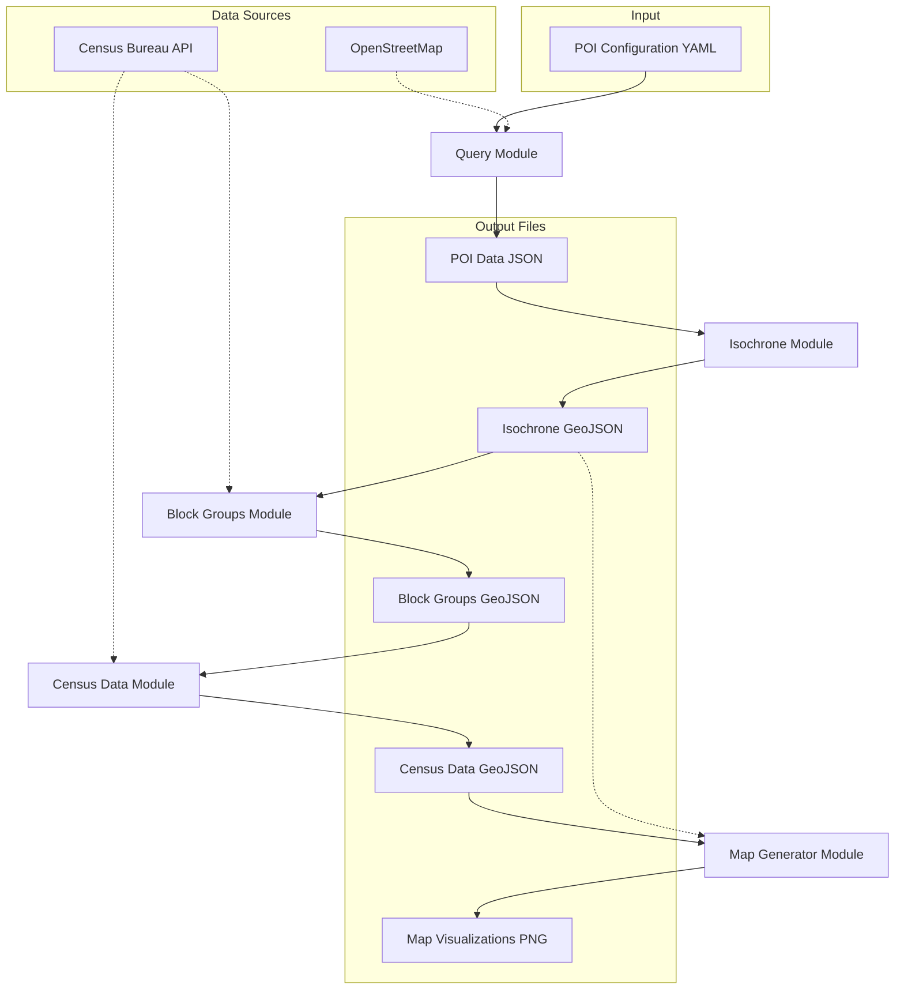

# Community Mapper

A Python toolkit for mapping community resources and analyzing demographic data around them.

## ⚠️ ALPHA STAGE ⚠️
This is an alpha release (v0.1.0-alpha). Major features are still missing and those implemented may contain significant bugs. Not recommended for production use.

## Overview

Community Mapper integrates several geospatial analysis tools to help understand the demographics of areas around community amenities. It provides an end-to-end pipeline for:

1. **Finding Points of Interest** - Query OpenStreetMap for libraries, schools, parks, healthcare facilities, etc.
2. **Generating Travel Time Areas** - Create isochrones showing areas reachable within a certain travel time
3. **Identifying Census Block Groups** - Determine which census block groups intersect with these areas
4. **Retrieving Demographic Data** - Pull census data for the identified areas
5. **Visualizing Results** - Generate maps showing the demographic variables around the POIs

## Installation

### Prerequisites

- Python 3.8 or later
- A Census API key (get one at https://api.census.gov/data/key_signup.html)

### Setup using uv

1. Clone this repository:
   ```bash
   git clone https://github.com/yourusername/community-mapper.git
   cd community-mapper
   ```

2. Create a virtual environment using uv:
   ```bash
   uv venv
   ```

3. Activate the virtual environment:
   ```bash
   # On Unix/Mac
   source .venv/bin/activate
   
   # On Windows
   .venv\Scripts\activate
   ```

4. Install dependencies:
   ```bash
   uv pip install -r requirements.txt
   ```

5. Set your Census API key as an environment variable:
   ```bash
   # On Unix/Mac
   export CENSUS_API_KEY="your-census-api-key"
   
   # On Windows
   set CENSUS_API_KEY=your-census-api-key
   ```

## Creating Your Own Community Maps: Step-by-Step Guide

### 1. Define Your Points of Interest

Create a YAML configuration file (e.g., `my_config.yaml`) to define what community resources you want to map:

```yaml
# Example: Schools in Austin, TX
geocode_area: "Austin"
state: "Texas"
city: "Austin"
type: "amenity"
name: "school"
```

Common POI types you can use:
- Libraries: `type: "amenity"`, `name: "library"`
- Schools: `type: "amenity"`, `name: "school"`
- Hospitals: `type: "amenity"`, `name: "hospital"`
- Parks: `type: "leisure"`, `name: "park"`
- Supermarkets: `type: "shop"`, `name: "supermarket"`
- Pharmacies: `type: "amenity"`, `name: "pharmacy"`

For more specific queries, use tags:
```yaml
geocode_area: "Chicago"
state: "Illinois"
city: "Chicago"
tags:
  amenity: "community_centre"
  operator: "Chicago Park District"
```

### 2. Choose Your Target States

Identify which states your analysis should cover. You'll need to provide state FIPS codes or abbreviations (e.g., "TX" or "48" for Texas).

For areas near state borders, include all relevant states to ensure complete coverage (e.g., "MO", "KS" for Kansas City).

### 3. Select Demographics to Analyze

Choose which census variables you want to analyze. Some useful options:

| Description | Census Variable | Notes |
|-------------|----------------|-------|
| Total Population | B01003_001E | Basic population count |
| Median Household Income | B19013_001E | In dollars |
| Median Home Value | B25077_001E | For owner-occupied units |
| Median Age | B01002_001E | Overall median age |
| White Population | B02001_002E | Population identifying as white alone |
| Black Population | B02001_003E | Population identifying as Black/African American alone |
| Hispanic Population | B03003_003E | Hispanic or Latino population of any race |
| Housing Units | B25001_001E | Total housing units |
| Education (Bachelor's or higher) | B15003_022E+B15003_023E+B15003_024E+B15003_025E | Sum of education categories |

### 4. Run the Community Mapper

Execute the end-to-end community mapping process:

```bash
python community_mapper.py --config my_config.yaml --travel-time 15 --census-variables B01003_001E B19013_001E B25077_001E
```

If your config file doesn't include a `state` field, you'll need to specify it:

```bash
python community_mapper.py --config my_config.yaml --state TX --travel-time 15 --census-variables B01003_001E B19013_001E B25077_001E
```

Parameters explained:
- `--config`: Your POI configuration file
- `--state`: State(s) to analyze (can list multiple: `TX OK LA`). Optional if specified in config file
- `--travel-time`: Travel time in minutes (how far can people travel from each POI)
- `--census-variables`: Census data to retrieve (list the variables you want)

### 5. Analyze the Results

After running the script, you'll find several outputs in the `output/` directory:
- JSON files with the POI data in `output/pois/`
- GeoJSON files with isochrones in `output/isochrones/`
- GeoJSON files with block groups in `output/block_groups/`
- GeoJSON files with census data in `output/census_data/`
- PNG map visualizations in `output/maps/`

The maps show each demographic variable for the areas within your specified travel time of the POIs.

### Example Projects

Here are some examples of community mapping projects you could create:

1. **Food Desert Analysis**: Map supermarkets with travel times and income data to identify areas with limited food access.
   ```bash
   # If state is in supermarkets.yaml
   python community_mapper.py --config supermarkets.yaml --travel-time 20 --census-variables B01003_001E B19013_001E
   
   # If state needs to be specified separately
   python community_mapper.py --config supermarkets.yaml --state NY --travel-time 20 --census-variables B01003_001E B19013_001E
   ```

2. **Healthcare Access**: Map hospitals and clinics with population and age demographics.
   ```bash
   python community_mapper.py --config healthcare.yaml --state CA --travel-time 30 --census-variables B01003_001E B01002_001E
   ```

3. **Educational Resource Distribution**: Map schools and libraries with educational attainment data.
   ```bash
   python community_mapper.py --config education.yaml --travel-time 15 --census-variables B15003_022E B15003_023E
   ```
   Note: This example assumes the `state` field is included in education.yaml.

4. **Park Access Equity**: Map parks with demographic and income data to assess equitable access.
   ```bash
   python community_mapper.py --config parks.yaml --state FL --travel-time 10 --census-variables B01003_001E B19013_001E B02001_002E B02001_003E
   ```

### Troubleshooting

- **No POIs found**: Check your POI configuration. Try making the query more general or verify that the location name is correct.
- **Census API errors**: Ensure your API key is valid and properly set as an environment variable.
- **Isochrone generation issues**: For very large areas, try reducing the travel time to avoid timeouts.
- **Missing block groups**: Ensure you've included all relevant state FIPS codes for your area of interest.

## Technical Documentation

### System Architecture

The Community Mapper follows a pipeline architecture where each component builds on the output of the previous one. Here's a diagram showing the data flow:



### Module Descriptions

1. **Query Module** (`src/query.py`):
   - Inputs: POI configuration (YAML)
   - Process: Builds and executes Overpass API queries to OpenStreetMap
   - Outputs: POI data (JSON)
   - Key Functions: `load_poi_config()`, `build_overpass_query()`, `query_overpass()`, `format_results()`

2. **Isochrone Module** (`src/isochrone.py`):
   - Inputs: POI data
   - Process: Builds road network graphs and calculates areas reachable within specified travel times
   - Outputs: Isochrone polygons (GeoJSON)
   - Key Functions: `create_isochrone_from_poi()`, `create_isochrones_from_poi_list()`

3. **Block Groups Module** (`src/blockgroups.py`):
   - Inputs: Isochrone polygons, State FIPS codes
   - Process: Identifies census block groups that intersect with isochrones
   - Outputs: Block group geometries (GeoJSON)
   - Key Functions: `get_census_block_groups()`, `isochrone_to_block_groups()`

4. **Census Data Module** (`src/census_data.py`):
   - Inputs: Block group geometries, Census variable codes
   - Process: Fetches demographic data from Census API for identified block groups
   - Outputs: Block groups with census data (GeoJSON)
   - Key Functions: `get_census_data_for_block_groups()`, `merge_census_data()`

5. **Map Generator Module** (`src/map_generator.py`):
   - Inputs: Block groups with census data, Variable codes to visualize
   - Process: Creates choropleth maps for each selected census variable
   - Outputs: Map visualizations (PNG)
   - Key Functions: `generate_map()`, `generate_maps_for_variables()`

### Data Flow

1. The user provides a POI configuration and parameters
2. POIs are retrieved from OpenStreetMap via the Overpass API
3. Isochrones are generated around each POI using road network analysis
4. Census block groups that intersect with isochrones are identified
5. Demographic data is fetched from the Census API for these block groups
6. Maps are generated visualizing the demographic variables

### Dependencies Between Components

- The isochrone module requires POI data with coordinates
- The block groups module requires isochrone polygons and state information
- The census data module requires block group geometries with GEOIDs
- The map generator requires both census data and (optionally) isochrone boundaries

## Basic Usage Reference

```bash
python community_mapper.py --config poi_config.yaml --state MO KS --travel-time 15
```

Arguments:
- `--config`: Path to the POI configuration YAML file
- `--state`: State(s) to analyze (abbreviation or FIPS code). Optional if the state is specified in the config file
- `--travel-time`: Travel time limit in minutes (default: 15)
- `--census-variables`: Census variables to retrieve (default: population and income)
- `--api-key`: Census API key (optional if set as environment variable)

### Example POI Configuration

Create a YAML file like this to configure which POIs to search for:

```yaml
# Libraries in Kansas City
geocode_area: "Kansas City"
state: "Missouri"  # Full state name is automatically converted to abbreviation (MO)
city: "Kansas City"
type: "amenity"
name: "library"
```

When specifying the `state` in your configuration file:
- Use the full state name (e.g., "Kansas", "Missouri", "California")
- The system will automatically convert it to the two-letter abbreviation for Census API calls
- This allows you to omit the `--state` command line argument

## Output

The script creates the following directory structure for outputs:

```
output/
├── pois/                 # POI data in JSON format
├── isochrones/           # Isochrone polygons in GeoJSON format
├── block_groups/         # Intersecting block groups in GeoJSON format
├── census_data/          # Block groups with census data in GeoJSON format
└── maps/                 # Generated maps in PNG format
```

## Using Individual Components

You can also use the individual modules separately for more customized analysis:

```python
from src.query import load_poi_config, build_overpass_query, query_overpass
from src.isochrone import create_isochrone_from_poi
from src.blockgroups import isochrone_to_block_groups
from src.census_data import get_census_data_for_block_groups
from src.map_generator import generate_map
```

## License

MIT License

## Acknowledgments

This toolkit makes use of several open-source libraries and data sources:
- [OpenStreetMap](https://www.openstreetmap.org/)
- [US Census Bureau API](https://www.census.gov/data/developers/data-sets.html)
- [OSMnx](https://github.com/gboeing/osmnx)
- [GeoPandas](https://geopandas.org/)
- [Matplotlib](https://matplotlib.org/)
- [Contextily](https://contextily.readthedocs.io/)
