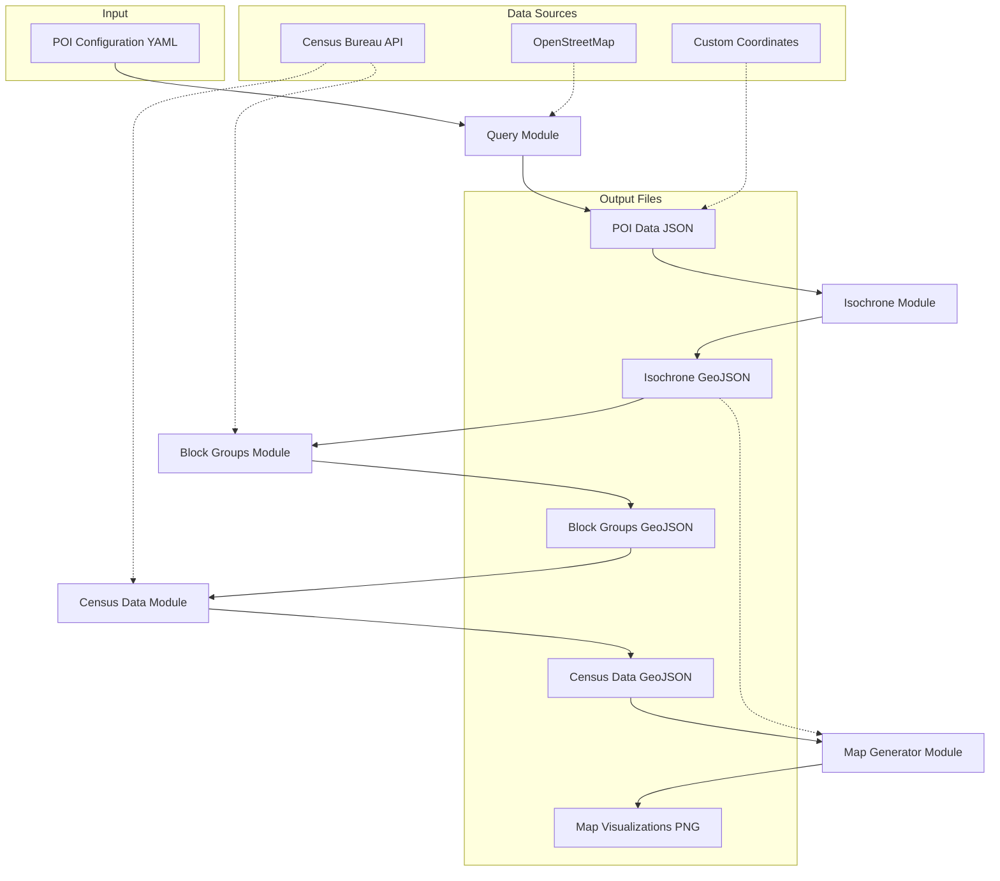

# 🏘️ SocialMapper: Explore Community Connections.

SocialMapper is an open-source Python toolkit that helps you understand how people connect with the important places in their community. Imagine taking a key spot like your local shopping center or school and seeing exactly what areas are within a certain travel time – whether it's a quick walk or a longer drive. SocialMapper does just that.

But it doesn't stop at travel time. SocialMapper also shows you the characteristics of the people who live within these accessible areas, like how many people live there and what the average income is. This helps you see who can easily reach vital community resources and identify any gaps in access.

Whether you're looking at bustling city neighborhoods or more spread-out rural areas, SocialMapper provides clear insights for making communities better, planning services, and ensuring everyone has good access to the places that matter.

With plans to expand and explore our connection to the natural world, SocialMapper is a tool for understanding people, places, and the environment around us.

## Features

- **Finding Points of Interest** - Query OpenStreetMap for libraries, schools, parks, healthcare facilities, etc.
- **Generating Travel Time Areas** - Create isochrones showing areas reachable within a certain travel time
- **Identifying Census Block Groups** - Determine which census block groups intersect with these areas
- **Retrieving Demographic Data** - Pull census data for the identified areas
- **Visualizing Results** - Generate maps showing the demographic variables around the POIs

## ⚠️ PRE-RELEASE ⚠️
This is an alpha release (v0.3.0-alpha). Major features are still missing and those implemented may contain significant bugs. Not recommended for production use.

## New in v0.3.0-alpha -- **SocialMapper Interactive Dashboard**

We now provide a Streamlit web app as a user-friendly interface to the Community Mapper tool. The web app allows you to:

- Query OpenStreetMap for points of interest or use your own coordinates
- Set travel times and select demographic variables 
- Visualize results with interactive maps
- No coding experience required!

### Running the Streamlit App

1. Make sure you've installed dependencies with `uv pip install -r requirements.txt`
2. Run the app with `streamlit run app.py`
3. Open your browser to http://localhost:8501 (if it doesn't open automatically)

The app provides an intuitive interface to configure your community mapping project, run the analysis, and visualize the results - all without writing a single line of code. It's perfect for:

- Urban planners analyzing access to public services
- Community organizations studying resource distribution 
- Researchers examining demographic patterns around facilities
- Anyone who wants to understand demographics around points of interest

For more information, see [STREAMLIT_README.md](STREAMLIT_README.md).

## Installation

### Prerequisites

- Python 3.9 or later
- A Census API key (get one at https://api.census.gov/data/key_signup.html)

### Easy Setup (Linux/Mac/Windows)

We provide a setup script that automates the installation process:

1. Clone this repository into your preferred location:
   ```bash
   git clone https://github.com/mihiarc/community-mapper.git
   cd community-mapper
   ```

#### For Linux/Mac:
2. Run the setup script:
   ```bash
   chmod +x setup_env.sh
   ./setup_env.sh
   ```

#### For Windows:
Simply double-click the `setup_env.bat` file in the project directory, or run it from Command Prompt:
```
setup_env.bat
```

This will:
    - Check if Python is installed
    - Install uv if needed
    - Create a virtual environment
    - Install all dependencies
    - Set up the required directory structure
    - Create a template .env file for your Census API key

After the script completes:
1. Edit the `.env` file in a text editor like notepad, and add your Census API key
2. Use the Command Prompt to activate the environment:
    ```
    .venv\Scripts\activate
    ```
3. Run the Streamlit app:
    ```
    streamlit run Home.py
    ```

## Creating Your Own Community Maps: Step-by-Step Guide

### 1. Define Your Points of Interest

Edit the included YAML configuration file (e.g., `my_config.yaml`) to define what community resources you want to map. If you already have your locations selected, skip to step 2.

```yaml
# Example:
geocode_area: "Fuquay-Varina"
state: "North Carolina"
city: "Fuquay-Varina"
type: "amenity"
name: "library"
```

Common OpenStreetMap POI types you can use:
- Libraries: `type: "amenity"`, `name: "library"`
- Schools: `type: "amenity"`, `name: "school"`
- Hospitals: `type: "amenity"`, `name: "hospital"`
- Parks: `type: "leisure"`, `name: "park"`
- Supermarkets: `type: "shop"`, `name: "supermarket"`
- Pharmacies: `type: "amenity"`, `name: "pharmacy"`

Check out the OpenStreetMap Wiki for more on map features: https://wiki.openstreetmap.org/wiki/Map_features

For more specific queries, use tags:
```yaml
geocode_area: "Chicago"
state: "Illinois"
city: "Chicago"
tags:
  amenity: "community_centre"
  operator: "Chicago Park District"
```

### 2. Choose Your Target States

Identify which states your analysis should cover. You'll need to provide state FIPS codes or abbreviations (e.g., "TX" or "48" for Texas).

For areas near state borders, include all relevant states to ensure complete coverage (e.g., "MO", "KS" for Kansas City).

### 3. Select Demographics to Analyze

Choose which census variables you want to analyze. Some useful options:

| Description                      | Notes                                      | SocialMapper Name    | Census Variable                                         |
|-------------------------------   |--------------------------------------------|--------------------------|----------------------------------------------------|
| Total Population                 | Basic population count                     | total_population         | B01003_001E                                        |
| Median Household Income          | In dollars                                 | median_income            | B19013_001E                                        |
| Median Home Value                | For owner-occupied units                   | median_home_value        | B25077_001E                                        |
| Median Age                       | Overall median age                         | median_age               | B01002_001E                                        |
| White Population                 | Population identifying as white alone      | white_population         | B02001_002E                                        |
| Black Population                 | Population identifying as Black/African American alone | black_population | B02001_003E                                     |
| Hispanic Population              | Hispanic or Latino population of any race  | hispanic_population      | B03003_003E                                        |
| Housing Units                    | Total housing units                        | housing_units            | B25001_001E                                        |
| Education (Bachelor's or higher) | Sum of education categories                | education_bachelors_plus | B15003_022E + B15003_023E + B15003_024E + B15003_025E   |

### 4. Run the Community Mapper

#### Using OpenStreetMap POIs

Execute the mapping process using POIs from OpenStreetMap or your own coordinates:

```bash
python community_mapper.py --config my_config.yaml --travel-time 15 --census-variables total_population
```

If your config file doesn't include a `state` field, you'll need to specify it:

```bash
python community_mapper.py --config my_config.yaml --state NC --travel-time 15 --census-variables median_age
```

#### Using Your Own Coordinates

If you already have latitude/longitude coordinates, you can skip the POI query step by providing your own CSV or JSON file. 

**Important: Your custom coordinates file MUST include state information for each point.** This is required for accurate census block group identification.

```bash
python community_mapper.py --custom-coords examples/custom_coordinates.csv --travel-time 15 --census-variables total_population
```

Supported formats for custom POIs:

1. CSV with header row (must include lat/lon and state columns):
```
id,name,lat,lon,state,type
1,"Community Center",37.7749,-122.4194,CA,public
2,"Food Bank",37.7833,-122.4167,CA,nonprofit
```

2. JSON list format:
```json
[
  {
    "id": "1",
    "name": "Community Center",
    "lat": 37.7749,
    "lon": -122.4194,
    "state": "CA",
    "tags": {
      "type": "public"
    }
  },
  {
    "id": "2",
    "name": "Food Bank",
    "lat": 37.7833,
    "lon": -122.4167,
    "state": "CA",
    "tags": {
      "type": "nonprofit"
    }
  }
]
```

The state column/field can contain either:
- Two-letter state abbreviations (e.g., "CA", "TX", "NY")
- Full state names (e.g., "California", "Texas", "New York")

Parameters explained:
- `--config`: Your POI configuration YAML file
- `--custom-coords`: Path to your custom coordinates CSV or JSON file
- `--state`: State(s) to analyze when using config file (can list multiple: `TX OK LA`). Not needed with custom coordinates.
- `--travel-time`: Travel time in minutes (how far can people travel from each POI)
- `--census-variables`: Census data to retrieve (list the variables you want)

### 5. Analyze the Results

After running the script, you'll find several outputs in the `output/` directory:
- JSON files with the POI data in `output/pois/`
- GeoJSON files with isochrones in `output/isochrones/`
- GeoJSON files with block groups in `output/block_groups/`
- GeoJSON files with census data in `output/census_data/`
- PNG map visualizations in `output/maps/`

The maps show each demographic variable for the areas within your specified travel time of the POIs.

### Example Projects

Here are some examples of community mapping projects you could create:

1. **Food Desert Analysis**: Map supermarkets with travel times and income data to identify areas with limited food access.
   ```bash
   # If state is in supermarkets.yaml
   python community_mapper.py --config supermarkets.yaml --travel-time 20 --census-variables B01003_001E B19013_001E
   
   # If state needs to be specified separately
   python community_mapper.py --config supermarkets.yaml --state NY --travel-time 20 --census-variables B01003_001E B19013_001E
   ```

2. **Healthcare Access**: Map hospitals and clinics with population and age demographics.
   ```bash
   python community_mapper.py --config healthcare.yaml --state CA --travel-time 30 --census-variables B01003_001E B01002_001E
   ```

3. **Educational Resource Distribution**: Map schools and libraries with educational attainment data.
   ```bash
   python community_mapper.py --config education.yaml --travel-time 15 --census-variables B15003_022E B15003_023E
   ```
   Note: This example assumes the `state` field is included in education.yaml.

4. **Park Access Equity**: Map parks with demographic and income data to assess equitable access.
   ```bash
   python community_mapper.py --config parks.yaml --state FL --travel-time 10 --census-variables B01003_001E B19013_001E B02001_002E B02001_003E
   ```

### Troubleshooting

- **No POIs found**: Check your POI configuration. Try making the query more general or verify that the location name is correct.
- **Census API errors**: Ensure your API key is valid and properly set as an environment variable.
- **Isochrone generation issues**: For very large areas, try reducing the travel time to avoid timeouts.
- **Missing block groups**: Ensure you've included all relevant state FIPS codes for your area of interest.
   For more information about obtaining block group geometries: https://tigerweb.geo.census.gov/arcgis/rest/services/TIGERweb/Tracts_Blocks/MapServer/1

## Technical Documentation

### System Architecture

The SocialMapper follows a pipeline architecture where each component builds on the output of the previous one. Here's a diagram showing the data flow:



### Module Descriptions

1. **Query Module** (`src/query.py`):
   - Inputs: POI configuration (YAML)
   - Process: Builds and executes Overpass API queries to OpenStreetMap
   - Outputs: POI data (JSON)
   - Key Functions: `load_poi_config()`, `build_overpass_query()`, `query_overpass()`, `format_results()`

2. **Isochrone Module** (`src/isochrone.py`):
   - Inputs: POI data (either from Query Module or custom coordinates)
   - Process: Builds road network graphs and calculates areas reachable within specified travel times
   - Outputs: Isochrone polygons (GeoJSON)
   - Key Functions: `create_isochrone_from_poi()`, `create_isochrones_from_poi_list()`

3. **Block Groups Module** (`src/blockgroups.py`):
   - Inputs: Isochrone polygons, State FIPS codes
   - Process: Identifies census block groups that intersect with isochrones
   - Outputs: Block group geometries (GeoJSON)
   - Key Functions: `get_census_block_groups()`, `isochrone_to_block_groups()`

4. **Census Data Module** (`src/census_data.py`):
   - Inputs: Block group geometries, Census variable codes
   - Process: Fetches demographic data from Census API for identified block groups
   - Outputs: Block groups with census data (GeoJSON)
   - Key Functions: `get_census_data_for_block_groups()`, `merge_census_data()`

5. **Map Generator Module** (`src/map_generator.py`):
   - Inputs: Block groups with census data, Variable codes to visualize
   - Process: Creates choropleth maps for each selected census variable
   - Outputs: Map visualizations (PNG)
   - Key Functions: `generate_map()`, `generate_maps_for_variables()`

## Census References

1. https://tigerweb.geo.census.gov/tigerwebmain/TIGERweb_restmapservice.html

2. https://developers.arcgis.com/rest/