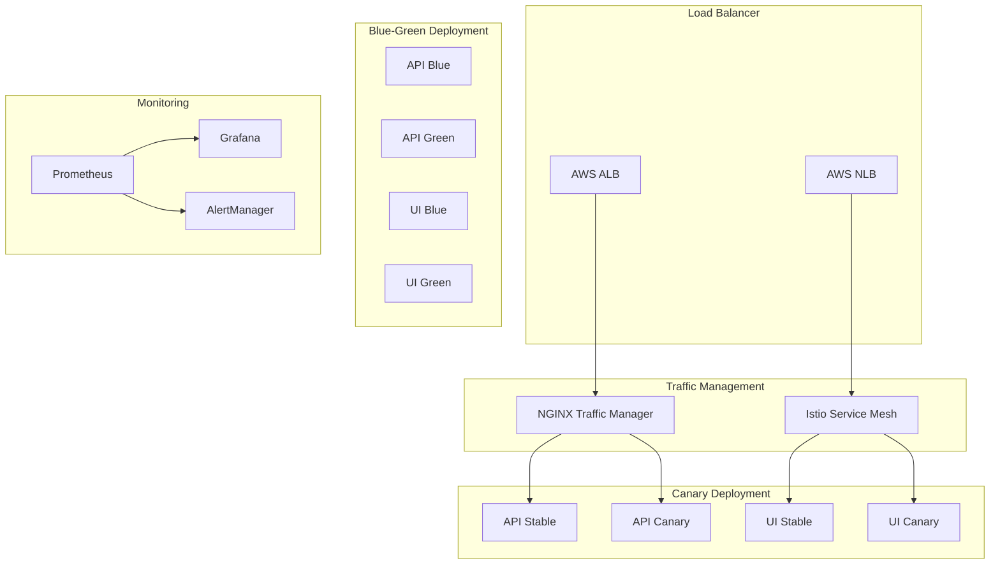
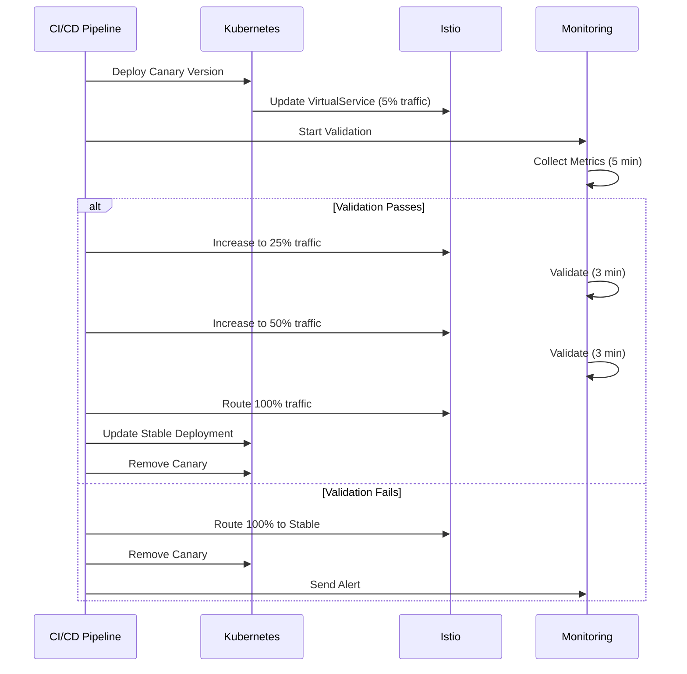
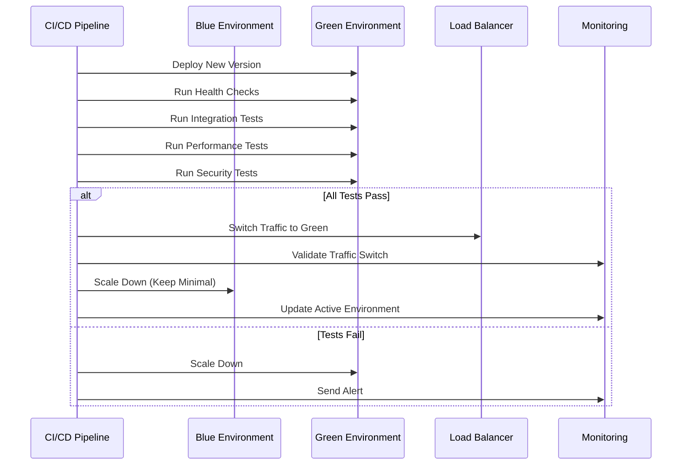

# Advanced Deployment Strategies for SocialMapper

This document provides comprehensive guidance on the advanced deployment strategies implemented for the SocialMapper project, including Canary deployments, Blue-Green deployments, and their operational procedures.

## Table of Contents

1. [Overview](#overview)
2. [Deployment Strategies](#deployment-strategies)
3. [Infrastructure Components](#infrastructure-components)
4. [Implementation Details](#implementation-details)
5. [Operational Procedures](#operational-procedures)
6. [Monitoring and Validation](#monitoring-and-validation)
7. [Rollback Procedures](#rollback-procedures)
8. [Troubleshooting](#troubleshooting)
9. [Best Practices](#best-practices)

## Overview

The SocialMapper project implements three advanced deployment strategies to ensure zero-downtime deployments, minimize risk, and provide quick rollback capabilities:

- **Canary Deployment**: Gradual traffic shifting with automated validation
- **Blue-Green Deployment**: Complete environment switching with pre-production testing
- **Rolling Update**: Traditional Kubernetes rolling updates with enhanced validation

### Architecture Overview



## Deployment Strategies

### 1. Canary Deployment

**Use Case**: Default strategy for feature releases and incremental updates

**How It Works**:
1. Deploy new version alongside current version
2. Route small percentage of traffic (5%) to canary
3. Monitor metrics and validate performance
4. Gradually increase traffic: 5% → 25% → 50% → 100%
5. Promote canary to stable or rollback if issues detected

**Advantages**:
- Low risk exposure
- Real user validation
- Automatic rollback on failure
- Gradual confidence building

**Configuration**:
```yaml
# Traffic distribution example
canary:
  api:
    percentage: 5
    max_percentage: 100
    increment_steps: [5, 25, 50, 100]
    validation_duration: 300  # 5 minutes per step
  ui:
    percentage: 2
    max_percentage: 100
    increment_steps: [2, 10, 25, 50, 100]
    validation_duration: 180  # 3 minutes per step
```

### 2. Blue-Green Deployment

**Use Case**: Major releases, database schema changes, high-risk deployments

**How It Works**:
1. Deploy new version to inactive environment (Green)
2. Run comprehensive pre-production testing
3. Switch traffic from Blue to Green instantly
4. Validate traffic switch and performance
5. Keep Blue environment for quick rollback

**Advantages**:
- Zero downtime deployments
- Complete pre-production validation
- Instant rollback capability
- Perfect for breaking changes

**Configuration**:
```yaml
# Blue-Green configuration
blue_green:
  environments:
    blue:
      replicas:
        api: 3
        ui: 2
    green:
      replicas:
        api: 3
        ui: 2
  validation:
    comprehensive_tests: true
    performance_tests: true
    security_tests: true
    duration: 600  # 10 minutes
```

### 3. Rolling Update

**Use Case**: Bug fixes, security patches, low-risk updates

**How It Works**:
1. Replace instances gradually
2. Maintain service availability during update
3. Built-in Kubernetes rollback capability
4. Enhanced with custom validation

**Configuration**:
```yaml
# Rolling update strategy
strategy:
  type: RollingUpdate
  rollingUpdate:
    maxUnavailable: 1
    maxSurge: 2
validation:
  health_checks: true
  smoke_tests: true
  rollback_on_failure: true
```

## Infrastructure Components

### Istio Service Mesh

**Purpose**: Advanced traffic management for Canary deployments

**Key Features**:
- Weighted traffic routing
- Header-based routing
- Circuit breaking
- Retry policies
- Fault injection for testing

**Configuration Files**:
- `infrastructure/kubernetes/canary-deployment.yaml`
- Istio Gateway, VirtualService, DestinationRule configurations

### NGINX Traffic Manager

**Purpose**: Load balancing and traffic splitting for Blue-Green deployments

**Key Features**:
- Upstream configuration
- Health checks
- Rate limiting
- Security headers
- Metrics collection

**Configuration Files**:
- `infrastructure/kubernetes/traffic-management.yaml`
- Custom NGINX configuration with Prometheus metrics

### AWS Load Balancer Controller

**Purpose**: External traffic routing and SSL termination

**Features**:
- ALB for HTTP(S) traffic
- NLB for TCP traffic
- SSL/TLS termination
- Health checks
- Access logs

## Implementation Details

### Canary Deployment Flow



### Blue-Green Deployment Flow



## Operational Procedures

### Manual Deployment Trigger

```bash
# Trigger Canary Deployment
gh workflow run advanced-deployment.yml \
  -f deployment_strategy=canary \
  -f environment=production \
  -f canary_percentage=5

# Trigger Blue-Green Deployment
gh workflow run advanced-deployment.yml \
  -f deployment_strategy=blue-green \
  -f environment=production \
  -f comprehensive_tests=true

# Trigger Rolling Update
gh workflow run advanced-deployment.yml \
  -f deployment_strategy=rolling-update \
  -f environment=staging
```

### Emergency Procedures

#### Immediate Rollback

```bash
# Automated Rollback
python3 .github/scripts/rollback-deployment.py \
  --deployment-strategy canary \
  --namespace socialmapper \
  --rollback-timeout 300

# Manual Override (if automated fails)
python3 .github/scripts/rollback-deployment.py \
  --deployment-strategy blue-green \
  --namespace socialmapper \
  --manual-override
```

#### Traffic Routing Override

```bash
# Route all traffic to stable (Canary)
kubectl patch virtualservice socialmapper-api-canary -n socialmapper --type='json' \
  -p='[{"op": "replace", "path": "/spec/http/0/route/0/weight", "value": 100},
      {"op": "replace", "path": "/spec/http/0/route/1/weight", "value": 0}]'

# Switch Blue-Green environment
kubectl patch service socialmapper-api-active -n socialmapper \
  -p '{"spec":{"selector":{"app.kubernetes.io/version":"blue"}}}'
```

### Health Check Commands

```bash
# Check deployment status
kubectl get deployments -n socialmapper -l deployment-type=canary
kubectl get deployments -n socialmapper -l deployment-type=blue-green

# Check service endpoints
kubectl get services -n socialmapper
kubectl get virtualservices -n socialmapper

# Check pod status
kubectl get pods -n socialmapper -l app.kubernetes.io/version=canary
kubectl get pods -n socialmapper -l environment=green

# Check ingress status
kubectl get ingress -n socialmapper
kubectl describe ingress socialmapper-blue-green-ingress -n socialmapper
```

## Monitoring and Validation

### Key Metrics

1. **Performance Metrics**:
   - Response time P95/P99
   - Request rate
   - Error rate
   - Availability

2. **Infrastructure Metrics**:
   - CPU utilization
   - Memory usage
   - Network I/O
   - Disk I/O

3. **Business Metrics**:
   - User satisfaction
   - Conversion rates
   - Feature usage
   - Error reports

### Prometheus Queries

```promql
# Error rate by version
rate(http_requests_total{status=~"5..", version="canary"}[5m]) / 
rate(http_requests_total{version="canary"}[5m])

# Response time P95
histogram_quantile(0.95, 
  rate(http_request_duration_seconds_bucket{version="canary"}[5m]))

# Availability
(
  rate(http_requests_total{version="canary"}[5m]) - 
  rate(http_requests_total{status=~"5..", version="canary"}[5m])
) / rate(http_requests_total{version="canary"}[5m])
```

### Grafana Dashboards

- **Canary Deployment Dashboard**: Real-time comparison between stable and canary versions
- **Blue-Green Status Dashboard**: Environment status and traffic routing visualization
- **Deployment Health Dashboard**: Overall system health and deployment status

### Alerting Rules

```yaml
groups:
- name: deployment.rules
  rules:
  - alert: CanaryHighErrorRate
    expr: rate(http_requests_total{status=~"5..", version="canary"}[5m]) > 0.01
    for: 2m
    annotations:
      summary: "Canary deployment has high error rate"
      
  - alert: BlueGreenSwitchFailed
    expr: up{job="blue-green-validator"} == 0
    for: 1m
    annotations:
      summary: "Blue-Green switch validation failed"
```

## Rollback Procedures

### Automatic Rollback Triggers

1. **Error Rate Threshold**: > 1% for Canary, > 5% for emergency
2. **Latency Threshold**: P99 > 5 seconds
3. **Availability Threshold**: < 99.9%
4. **Health Check Failures**: 3 consecutive failures
5. **Custom Business Metrics**: Configurable thresholds

### Rollback Strategies

#### Canary Rollback
1. Immediately route 100% traffic to stable
2. Scale down canary deployments
3. Remove Istio canary configuration
4. Validate stable version performance
5. Clean up canary resources

#### Blue-Green Rollback
1. Switch traffic back to previous environment
2. Validate traffic switch
3. Scale down failed environment
4. Update monitoring configuration
5. Run post-rollback validation

#### Rolling Update Rollback
1. Use `kubectl rollout undo`
2. Wait for rollout completion
3. Validate deployment health
4. Run functionality tests

### Manual Rollback Procedures

```bash
# Get rollback information
kubectl rollout history deployment/socialmapper-api -n socialmapper

# Rollback to previous version
kubectl rollout undo deployment/socialmapper-api -n socialmapper

# Rollback to specific revision
kubectl rollout undo deployment/socialmapper-api --to-revision=2 -n socialmapper

# Check rollback status
kubectl rollout status deployment/socialmapper-api -n socialmapper
```

## Troubleshooting

### Common Issues and Solutions

#### 1. Canary Deployment Issues

**Issue**: Canary pods not receiving traffic
```bash
# Check VirtualService configuration
kubectl describe virtualservice socialmapper-api-canary -n socialmapper

# Check service endpoints
kubectl get endpoints -n socialmapper

# Verify Istio sidecar injection
kubectl get pods -n socialmapper -o jsonpath='{.items[*].spec.containers[*].name}'
```

**Issue**: High error rate in canary
```bash
# Check pod logs
kubectl logs -l app.kubernetes.io/version=canary -n socialmapper

# Check resource constraints
kubectl describe pods -l app.kubernetes.io/version=canary -n socialmapper

# Validate configuration
kubectl get configmap -n socialmapper
```

#### 2. Blue-Green Deployment Issues

**Issue**: Green environment not healthy
```bash
# Check deployment status
kubectl get deployment socialmapper-api-green -n socialmapper -o yaml

# Check resource availability
kubectl describe nodes

# Validate environment variables
kubectl exec deployment/socialmapper-api-green -n socialmapper -- env
```

**Issue**: Traffic not switching
```bash
# Check service selectors
kubectl get service socialmapper-api-active -n socialmapper -o yaml

# Verify ingress configuration
kubectl describe ingress -n socialmapper

# Check DNS resolution
kubectl exec -it deploy/socialmapper-api-green -n socialmapper -- nslookup socialmapper-api-active
```

#### 3. Network and Connectivity Issues

```bash
# Test service connectivity
kubectl exec -it deploy/nginx-traffic-manager -n socialmapper -- curl http://socialmapper-api-service:8000/api/v1/health

# Check network policies
kubectl get networkpolicies -n socialmapper

# Verify ingress controller
kubectl get pods -n ingress-nginx
kubectl logs -n ingress-nginx deployment/ingress-nginx-controller
```

### Debugging Commands

```bash
# Get comprehensive deployment status
kubectl get all -n socialmapper

# Check events
kubectl get events -n socialmapper --sort-by='.lastTimestamp'

# Pod troubleshooting
kubectl describe pod <pod-name> -n socialmapper
kubectl logs <pod-name> -n socialmapper --previous

# Network debugging
kubectl exec -it <pod-name> -n socialmapper -- netstat -tlnp
kubectl exec -it <pod-name> -n socialmapper -- ss -tlnp
```

## Best Practices

### Deployment Strategy Selection

1. **Use Canary for**:
   - Feature releases
   - API changes
   - Performance improvements
   - User-facing updates

2. **Use Blue-Green for**:
   - Major version releases
   - Database schema changes
   - Infrastructure updates
   - Breaking changes

3. **Use Rolling Updates for**:
   - Bug fixes
   - Security patches
   - Configuration updates
   - Minor improvements

### Validation Strategy

1. **Pre-deployment**:
   - Code quality checks
   - Security scanning
   - Performance testing
   - Integration testing

2. **During deployment**:
   - Health checks
   - Smoke tests
   - Metrics monitoring
   - User feedback

3. **Post-deployment**:
   - Performance validation
   - Error rate monitoring
   - User experience tracking
   - Business metrics

### Monitoring and Alerting

1. **Set appropriate thresholds**:
   - Error rates: 1% for warnings, 5% for critical
   - Latency: P95 < 2s, P99 < 5s
   - Availability: > 99.9%

2. **Use multiple validation methods**:
   - Synthetic monitoring
   - Real user monitoring
   - Health checks
   - Business metrics

3. **Implement proper alerting**:
   - Immediate notifications for critical issues
   - Escalation procedures
   - On-call rotation
   - Documentation links in alerts

### Security Considerations

1. **Network Security**:
   - Network policies
   - Service mesh security
   - TLS everywhere
   - Certificate management

2. **Access Control**:
   - RBAC for deployments
   - Service account permissions
   - Audit logging
   - Secrets management

3. **Validation**:
   - Security scanning
   - Vulnerability assessments
   - Compliance checks
   - Penetration testing

### Performance Optimization

1. **Resource Management**:
   - Appropriate resource limits
   - HPA configuration
   - Node affinity
   - Pod disruption budgets

2. **Caching Strategy**:
   - CDN configuration
   - Application caching
   - Database caching
   - Static asset optimization

3. **Monitoring**:
   - Performance profiling
   - Resource utilization
   - Bottleneck identification
   - Capacity planning

## Conclusion

The advanced deployment strategies implemented for SocialMapper provide a robust, scalable, and low-risk approach to software releases. By combining Canary deployments for gradual rollouts, Blue-Green deployments for major changes, and enhanced Rolling updates for routine updates, the system ensures high availability while minimizing the impact of potential issues.

Key benefits of this implementation:

- **Zero-downtime deployments** across all strategies
- **Automated validation and rollback** capabilities
- **Comprehensive monitoring and alerting**
- **Flexible deployment options** based on risk assessment
- **Production-ready infrastructure** with proper security and performance considerations

For questions or issues with the deployment strategies, refer to the troubleshooting section or contact the DevOps team.