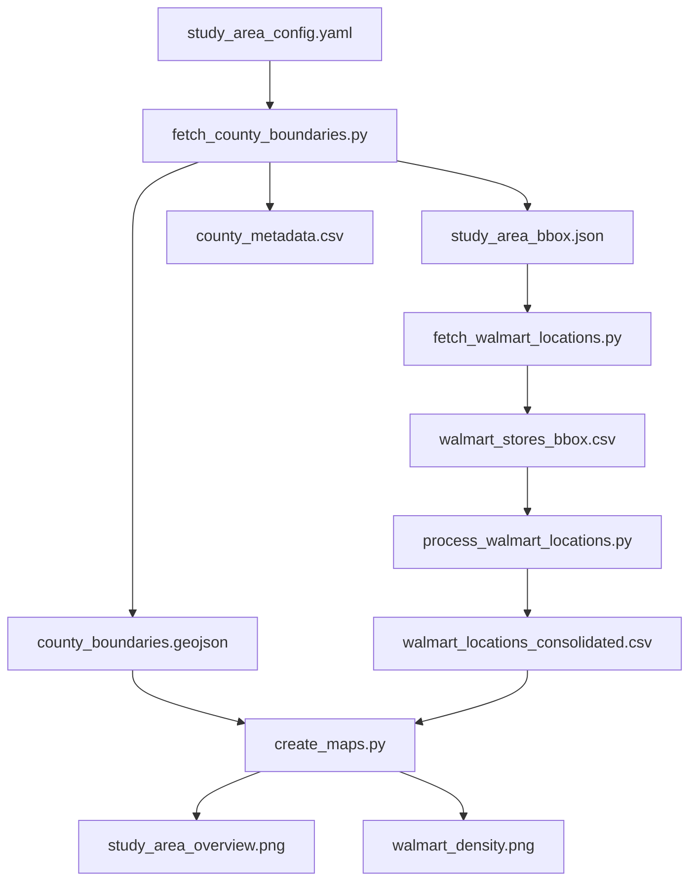
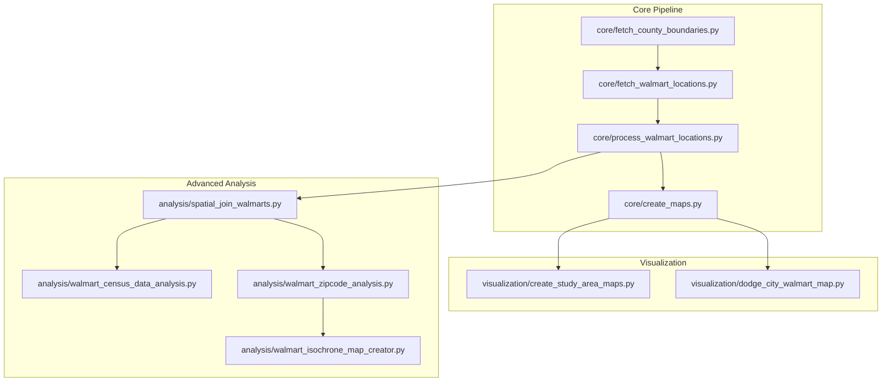

# NRCS Conservation Study Area Analysis

This project analyzes Walmart store locations within a specific study area defined for NRCS conservation efforts. The analysis covers selected counties across Kansas, New Mexico, Oklahoma, and Texas.

## Project Structure

The scripts are organized into three main categories:

- **Core**: Essential scripts for the main data processing pipeline
- **Visualization**: Scripts for creating various visualization maps
- **Analysis**: Advanced analysis scripts for deeper insights

## Data Processing Pipeline



## Script Workflow



## Pipeline Steps

1. **County Boundaries** (`core/fetch_county_boundaries.py`)
   - Reads study area configuration from `study_area_config.yaml`
   - Fetches county boundaries from Census TIGER/Web service
   - Outputs:
     - `county_boundaries.geojson`: County geometries
     - `study_area_bbox.json`: Bounding box for the study area
     - `county_metadata.csv`: County attributes

2. **Walmart Locations** (`core/fetch_walmart_locations.py`)
   - Uses bounding box from previous step
   - Fetches Walmart locations from OpenStreetMap
   - Outputs `walmart_stores_bbox.csv` with raw store data

3. **Location Processing** (`core/process_walmart_locations.py`)
   - Consolidates multiple services at same location
   - Extracts service types from store names
   - Outputs `walmart_locations_consolidated.csv`

4. **Map Creation** (`core/create_maps.py`)
   - Creates two visualization maps:
     - `study_area_overview.png`: Shows Walmart locations by type
     - `walmart_density.png`: Shows store distribution by county

## Advanced Analysis Scripts

- **Spatial Join** (`analysis/spatial_join_walmarts.py`): Joins Walmart data with geographic boundaries
- **Census Analysis** (`analysis/walmart_census_data_analysis.py`): Analyzes store distribution against census data
- **Zipcode Analysis** (`analysis/walmart_zipcode_analysis.py`): Performs analysis by zipcode regions
- **Isochrone Maps** (`analysis/walmart_isochrone_map_creator.py`): Creates travel time maps from store locations

## Additional Visualization Scripts

- **Study Area Maps** (`visualization/create_study_area_maps.py`): Creates additional study area visualizations
- **Dodge City Map** (`visualization/dodge_city_walmart_map.py`): Creates a specialized map for Dodge City

## Data Files

### Input
- `study_area_config.yaml`: Defines study area counties and states

### Intermediate
- `county_boundaries.geojson`: County boundary geometries
- `study_area_bbox.json`: Study area extent
- `county_metadata.csv`: County attributes
- `walmart_stores_bbox.csv`: Raw Walmart store data
- `walmart_locations_consolidated.csv`: Processed store data

### Output
- `study_area_overview.png`: Map of Walmart locations by type
- `walmart_density.png`: Map of store distribution by county

## Dependencies

- `pandas`: Data processing
- `geopandas`: Spatial data handling
- `requests`: API requests
- `overpy`: OpenStreetMap API wrapper
- `matplotlib`: Mapping
- `contextily`: Basemaps
- `PyYAML`: Configuration file parsing

## Usage

Run the core scripts in sequence:

```bash
# 1. Fetch county boundaries
python scripts/core/fetch_county_boundaries.py

# 2. Fetch Walmart locations
python scripts/core/fetch_walmart_locations.py

# 3. Process Walmart locations
python scripts/core/process_walmart_locations.py

# 4. Create maps
python scripts/core/create_maps.py
```

For advanced analysis, run the additional scripts as needed. 